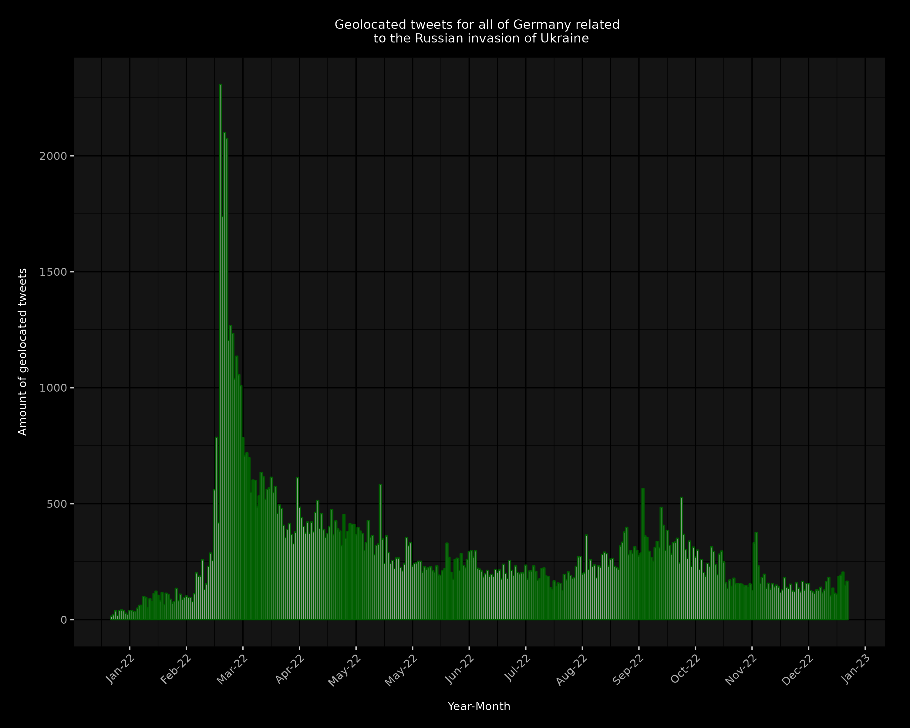
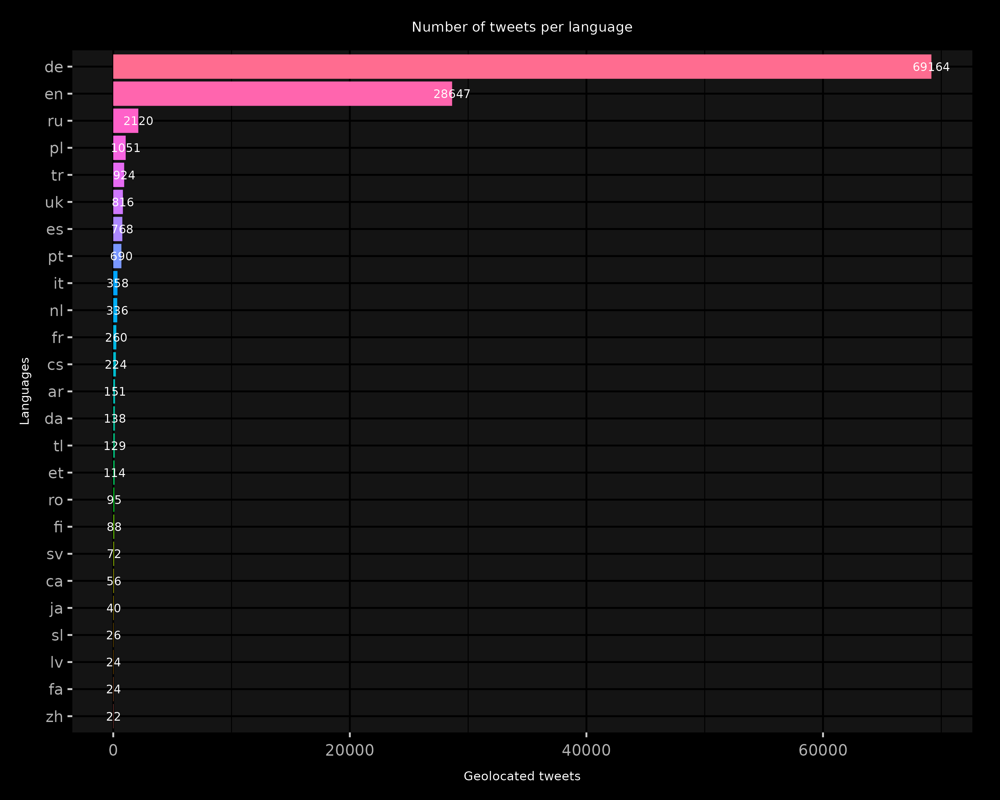
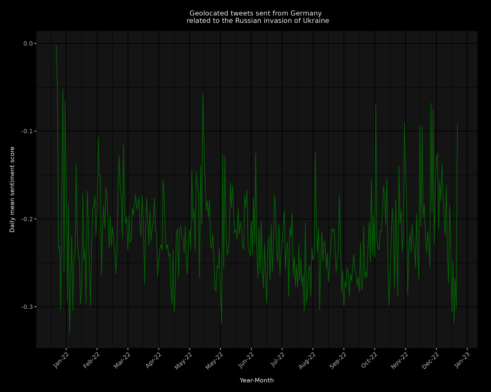

# IDSTA22-Team-Heigit

# Proposal links

- link to Tex https://de.overleaf.com/7975813297sqrrgdrscysd

# Introduction

"[E]verything is related to everything else, but near things are more related
than distant things". 
Tobler’s first rule was abruptly brought to the at-
tention of the people of Europe, and Germany in particular, as a result of
Russia’s attack on Ukraine in february 2022. In addition to the mental factor
of having a war not far from the own borders, the population is particularly
affected by the strong dependence on Russian resources due to the geograph-
ical proximity. 

In order to pre-empt an escalation of political tensions within the population, 
it is therefore useful to create an overview of the spatial distribution of
residents who support or do not support the government’s current direction
and which events have had an impact on public perception.
As one of the most well-known social media platforms that offers the pos-
sibility to export content and geolocation of a message, Twitter represents
the best opportunity to analyze the influence of socio-economic factors and
geopolitical events on social attitudes towards the war in Ukraine.


# Tweets

In order to retrieve tweets sent from Germany that address Russia’s attack on Ukraine, we relied on the R package [academictwitteR](https://github.com/user/repo/blob/branch/other_file.md). We were able to retrieve 106.000 tweets. 




Most of the tweets were written in german. Nevertheless, we also identified tweets in russian, polish, turkish and ukrainian. 




The sentiment score of the tweets is depicted below. We calculated the daily mean sentiment score. 



We carried out our analysis with this dataset. 


# Documentation

## Requirements 

In order to run this project the following dependencies must be met.

### Conda 

Conda needs to be installed on the machine as well as an environment that is based on the provided ENV.yml. The environment needs to be imported.
To do so one can use the following command.
conda env create -n ENVNAME --file code/ENV.yml


### Npm 

## Elastic search

An elastic search connection must be provided. Please note that currently the security setting (xpack.security.enabled) must be set false in your [elasticsearch.yml](https://www.elastic.co/guide/en/elasticsearch/reference/current/security-settings.html)
The Authors used the elastic search version 8.6.2.


## Usage

with the following command, different functionalities can be triggered. 
```console
python ./code/Python/main.py ["preprocess","process","api","bulk"full","full+bulk"] -c ./code/default.config
```
Note that a valid config file needs to be provided. For this project the code/default.config is used.
### Preprocess
Start the preprocessing, which cleans up the individual tweets and translates them into english.
### Process
Applies the models for NER and sentiment classification and writes the results directly to the elastic search index.
Note that incase the index is missing, it will be created.
### Api
launches the api using uvicorn.
### Full 
executes the three steps above
### Bulk 
as a shortcut, the results from the steps preprocessing and processing, have been stored as a json.
This command allows to load these directly into the defined Index, without the need of processing.
### Full+Bulk
trigers the bulk command and launches the api.

## API Endpoint
the api offers one endpoint called 

